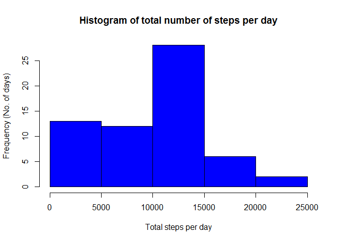
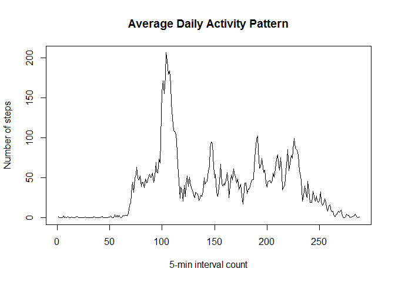
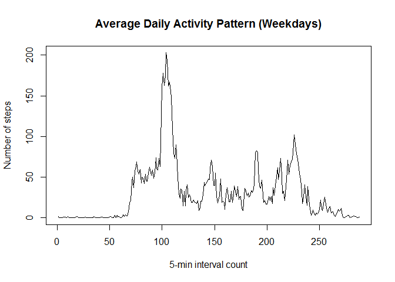
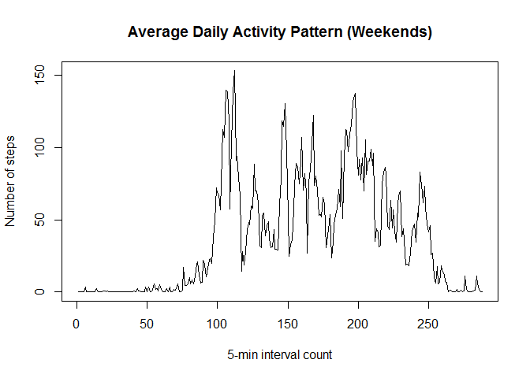

# Reproducible Research: Peer Assessment 1

=========================================================================

## Loading and preprocessing the data
The data is in a `.csv` file named `activity.csv`. Following is the code to load the data into R workspace (assuming that `activity.csv` is present in the workspace), display top 6 rows, and structure of the dataset using `str()`:


```r
activity <- read.csv("activity.csv")
head(activity)
```

```
##   steps       date interval
## 1    NA 2012-10-01        0
## 2    NA 2012-10-01        5
## 3    NA 2012-10-01       10
## 4    NA 2012-10-01       15
## 5    NA 2012-10-01       20
## 6    NA 2012-10-01       25
```

```r
str(activity)
```

```
## 'data.frame':	17568 obs. of  3 variables:
##  $ steps   : int  NA NA NA NA NA NA NA NA NA NA ...
##  $ date    : Factor w/ 61 levels "2012-10-01","2012-10-02",..: 1 1 1 1 1 1 1 1 1 1 ...
##  $ interval: int  0 5 10 15 20 25 30 35 40 45 ...
```

=========================================================================

## What is mean total number of steps taken per day?
Ignoring missing values in the dataset.

1. Making a histogram of the total number of steps taken each day


```r
stepsPerDay <- tapply(activity$steps, activity$date, sum, na.rm=T)
hist(stepsPerDay, main="Histogram of total number of steps per day", xlab="Total steps per day", ylab="Frequency (No. of days)", col="blue")
```

 

2. Calculating the **mean** and **median** total number of steps taken per day


```r
stepsMean <- mean(stepsPerDay)
stepsMedian <- median(stepsPerDay)
```

**Mean** --> 9354.2295082

**Median** --> 10395

=========================================================================

## What is the average daily activity pattern?

1. Make a time series plot of the 5-min interval (x-axis) and the average number of steps taken, averaged across all days (y-axis)


```r
activity[,3]<- as.factor(activity$interval)
stepsPerInt <- tapply(activity$steps, activity$interval, mean, na.rm=T)
plot(stepsPerInt, type='l', main="Average Daily Activity Pattern", xlab="5-min interval count", ylab="Number of steps")
```

 

2. Which 5-minute interval, on average across all the days in the dataset, contains the maximum number of steps?


```r
maxStepsInt <- names(which.max(stepsPerInt))
```

The 5-minute interval with maximum average number of steps = 835


=========================================================================


## Inputing missing values

1. Total Number of missing values in the dataset.


```r
noOfNA <- sum(is.na(activity$steps))
```

Total No of NA --> 2304


2. Filling in all the missing values in the dataset. Strategy is to replace NA with 0s


```r
steps <- activity$steps
for(i in seq_along(steps)){ 
     if(is.na(steps[i]))
          steps[i]<- 0
}
sum(is.na(steps))
```

```
## [1] 0
```

3. Creating a new dataset with the new step values without any NAs


```r
newActData <- cbind(steps=steps, activity[,c(2,3)])
head(newActData)
```

```
##   steps       date interval
## 1     0 2012-10-01        0
## 2     0 2012-10-01        5
## 3     0 2012-10-01       10
## 4     0 2012-10-01       15
## 5     0 2012-10-01       20
## 6     0 2012-10-01       25
```

```r
str(newActData)
```

```
## 'data.frame':	17568 obs. of  3 variables:
##  $ steps   : num  0 0 0 0 0 0 0 0 0 0 ...
##  $ date    : Factor w/ 61 levels "2012-10-01","2012-10-02",..: 1 1 1 1 1 1 1 1 1 1 ...
##  $ interval: Factor w/ 288 levels "0","5","10","15",..: 1 2 3 4 5 6 7 8 9 10 ...
```


4. Histogram of total steps taken each day + mean and median as before on the new data set. Do these values differ from before?

Histogram


```r
stepsPerDayNew <- tapply(newActData$steps, newActData$date, sum)
hist(stepsPerDayNew, main="Histogram of total number of steps per day", xlab="Total steps per day", ylab="Frequency (No. of days)", col="blue")
```

 

Mean and Median


```r
stepsMeanNew <- mean(stepsPerDay)
stepsMedianNew <- median(stepsPerDay)
```

**Mean** ---> 9354.2295082

**Median** ---> 10395

There is no change in the result as compared to the first part of the assignment. This shows replacing 0s is not a good strategy for filling up the NA values.


=========================================================================

## Are there differences in activity patterns between weekdays and weekends?

Creating new factor variable with corresponding weekdays.


```r
days <- weekdays(as.Date(newActData$date))
for(i in seq_along(days)){ 
     if(days[i] %in% c("Saturday","Sunday"))
          days[i]<- c("weekend")
     else
          days[i]<- c("weekday")
}
days <- as.factor(days)
newActData <- cbind(newActData, days=days)
```

Creating plot


```r
weekdaysSubset <- newActData[newActData$days %in% c("weekday"),c(1,3)]
weekendsSubset <- newActData[newActData$days %in% c("weekend"),c(1,3)]
avgStepsWeekdays <- tapply(weekdaysSubset$steps, weekdaysSubset$interval, mean)
avgStepsWeekends <- tapply(weekendsSubset$steps, weekendsSubset$interval, mean)
plot(avgStepsWeekdays, type='l', main="Average Daily Activity Pattern (Weekdays)", xlab="5-min interval count", ylab="Number of steps")
```

 

```r
plot(avgStepsWeekends, type='l', main="Average Daily Activity Pattern (Weekends)", xlab="5-min interval count", ylab="Number of steps")
```

 


=========================================================================
